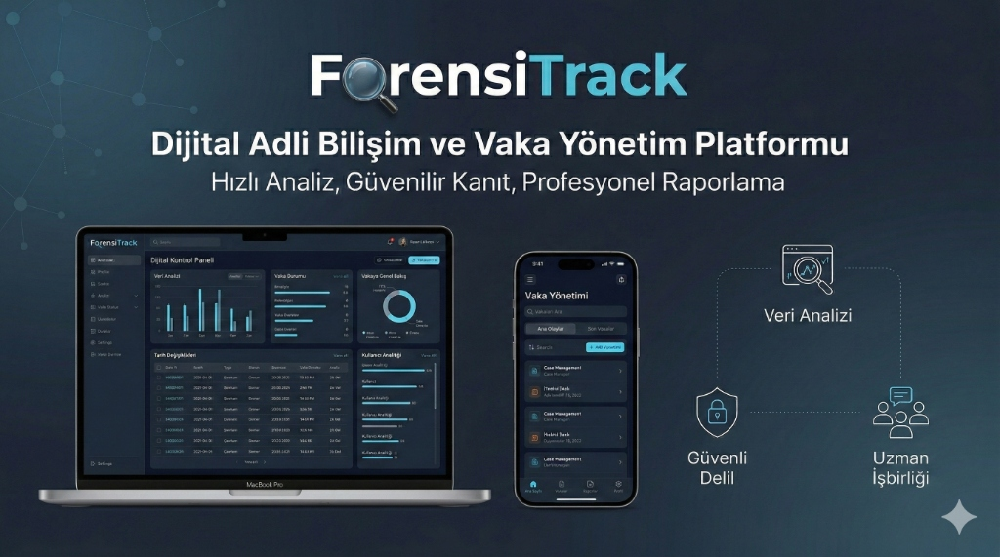

# ForensiTrack

---

## Proje Hakkında

**Proje Tanımı:**
ForensiTrack, dijital adli bilişim uzmanları için tasarlanmış kapsamlı bir vaka yönetim ve sektörel hizmet platformudur. Platform, yaygın olarak kullanılan adli bilişim araçlarının kullanım senaryolarını içeren bir bilgi bankası sunarken; uzmanların hizmet ilanları yayınlayabildiği ve vaka süreçlerini dinamik bir dashboard üzerinden yönettikleri bir ekosistem sağlar.

**Proje Kategorisi:**
Adli Bilişim ve Vaka Yönetim Sistemleri

**Referans Uygulama:**

* [Upwork](https://upwork.com) (Hizmet/İlan Modeli)
* [Autopsy Documentation](https://www.sleuthkit.org/autopsy/docs.php) (Bilgi Bankası)

---

## Proje Linkleri

(Olası Adresler)
* **REST API Adresi:** [api.forensitrack.com](https://www.google.com/search?q=https://api.forensitrack.com)
* **Web Frontend Adresi:** [frontend.forensitrack.com](https://www.google.com/search?q=https://frontend.forensitrack.com)

---

## Proje Ekibi

**Grup Adı:**
ForensiTeam

**Ekip Üyeleri:**

* Yiğit Bayraktar
* Ümmühan Atmaca

---

## Dokümantasyon

Proje dokümantasyonuna aşağıdaki linklerden erişebilirsiniz:

1. [Gereksinim Analizi](Gereksinim-Analizi.md)
2. [REST API Tasarımı](API-Tasarimi.md)
3. [REST API](Rest-API.md)
4. [Web Front-End](WebFrontEnd.md)
5. [Mobil Front-End](MobilFrontEnd.md)
6. [Mobil Backend](MobilBackEnd.md)
7. [Video Sunum](Sunum.md)